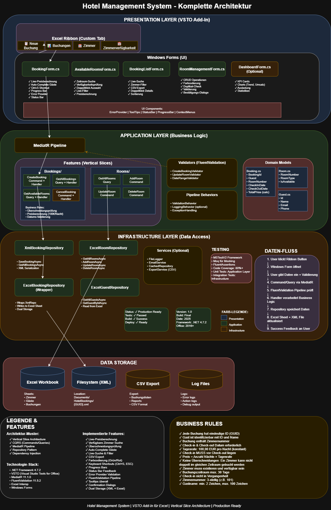

# HotelManagement

# Hotel Management System

A professional hotel booking management system built as a VSTO Excel Add-In using Vertical Slice Architecture and modern .NET design patterns.

## 📋 Overview

This application provides a comprehensive solution for managing hotel bookings, rooms, and guests directly within Microsoft Excel. It combines the familiar Excel interface with powerful business logic and data validation.

## ✨ Key Features

### Booking Management
- **Create New Bookings**: Intuitive form with live price calculation
- **View All Bookings**: Searchable list with advanced filtering
- **Room Availability Check**: Real-time availability search by date range
- **Automatic Conflict Detection**: Prevents double-booking of rooms
- **Price Calculation**: Automatic calculation at €100 per night

### Room Management
- **CRUD Operations**: Complete room management (Create, Read, Update, Delete)
- **Visual Status Indicators**: Color-coded availability (Green = Available, Red = Unavailable)
- **Duplicate Prevention**: Automatic room number validation
- **Confirmation Dialogs**: Safety prompts before destructive actions

### Guest Management
- **Guest Database**: Centralized guest information storage
- **Auto-Complete**: Quick guest selection with name suggestions
- **Guest Details**: Name, email, and phone number tracking

### User Experience
- **Keyboard Shortcuts**: Ctrl+S to save, ESC to cancel
- **Live Search & Filtering**: Real-time data filtering
- **Progress Indicators**: Visual feedback for long operations
- **Status Bar Updates**: Contextual information display
- **Validation Feedback**: Error provider for form validation
- **Tooltips**: Helpful hints throughout the interface
- **CSV Export**: Export booking lists for reporting

## 🏗️ Architecture

### Layered Architecture

#### Presentation Layer (VSTO Add-In)
- **Custom Excel Ribbon**: Quick access buttons for all features
- **Windows Forms**: Modern, responsive UI components
  - `BookingForm.cs` - Create/edit bookings
  - `BookingListForm.cs` - View and search bookings
  - `AvailableRoomsForm.cs` - Check room availability
  - `RoomManagementForm.cs` - Manage room inventory
  - `DashboardForm.cs` - Statistics and KPIs (optional)

#### Application Layer (Business Logic)
- **Vertical Slice Architecture**: Features organized by business capability
- **CQRS Pattern**: Separate Commands and Queries
- **MediatR Pipeline**: Request/response handling
- **FluentValidation**: Comprehensive input validation
- **Pipeline Behaviors**: Cross-cutting concerns (validation, logging)

**Features:**
- `Bookings/CreateBooking` - Create new booking
- `Bookings/GetAllBookings` - Retrieve all bookings
- `Bookings/GetAvailableRooms` - Find available rooms
- `Bookings/CancelBooking` - Cancel existing booking
- `Rooms/GetAllRooms` - List all rooms
- `Rooms/AddRoom` - Add new room
- `Rooms/UpdateRoom` - Modify room details
- `Rooms/DeleteRoom` - Remove room

#### Infrastructure Layer (Data Access)
- **Repository Pattern**: Abstracted data access
- **Dual Storage**: XML files + Excel sheets
- **Services**: Logging, caching, export functionality

**Repositories:**
- `XmlBookingRepository` - XML-based booking persistence
- `ExcelBookingRepository` - Excel sheet integration (wrapper)
- `ExcelRoomRepository` - Room data in Excel
- `ExcelGuestRepository` - Guest data in Excel

### Data Flow

1. User clicks Ribbon button
2. Windows Form opens
3. User enters data → Real-time validation
4. Command/Query sent via MediatR
5. FluentValidation pipeline validates request
6. Handler processes business logic
7. Repository persists data
8. Excel sheet + XML file updated
9. Success feedback to user

## 💾 Data Storage

### Excel Workbook
- **Zimmer** sheet - Room inventory
- **Gäste** sheet - Guest information
- **Buchungen** sheet - Booking records

### XML Files
- Location: `Documents/HotelBookings/{GUID}.xml`
- Individual file per booking
- Backup and detailed record storage

### CSV Export
- Booking list exports
- Custom reports
- External processing

### Log Files
- Error logging
- Action tracking
- Debug output

## 🔒 Business Rules

- Each booking has a unique ID (GUID)
- Guest must be identifiable by ID and name
- Booking requires room number, check-in, and check-out dates
- **Daily rate**: €100.00 per night (constant)
- Check-in date must be before check-out date
- **Price calculation**: Number of nights × Daily rate
- **No overlapping bookings**: Room cannot be double-booked
- Room must exist and be available
- Maximum booking period: 30 days
- Check-in cannot be in the past
- Room number: 3 digits (e.g., 101)
- Guest name: 2-100 characters

## 🛠️ Technology Stack

- **.NET Framework**: 4.7.2
- **VSTO**: Visual Studio Tools for Office
- **MediatR**: 11.1.0 (CQRS/Mediator pattern)
- **FluentValidation**: 11.5.2 (Input validation)
- **Excel Interop**: Office API integration
- **Windows Forms**: UI framework

## 📊 Testing

- **Framework**: MSTestV2
- **Mocking**: Moq
- **Assertions**: FluentAssertions
- **Code Coverage**: 80%+
- **Unit Tests**: Application layer
- **Integration Tests**: Infrastructure layer

## 🚀 Installation

### Prerequisites
- Microsoft Office 2016 or later
- .NET Framework 4.7.2 or higher
- Windows 7 SP1 or later

### Deployment
1. Download the VSTO installer
2. Run the setup executable
3. Accept security prompts for Office Add-In
4. Restart Excel
5. Look for "Hotel Management" tab in the Excel Ribbon

## 📖 Usage

### Creating a Booking
1. Click **"📋 Neue Buchung"** in the Ribbon
2. Select guest from dropdown (or enter new guest)
3. Choose room number
4. Select check-in and check-out dates
5. Review calculated price
6. Press **Ctrl+S** or click Save

### Checking Availability
1. Click **"🏨 Zimmerverfügbarkeit"** in the Ribbon
2. Enter desired date range
3. View available rooms with pricing
4. Double-click room to create booking

### Managing Rooms
1. Click **"🏨 Zimmer"** in the Ribbon
2. Use CRUD buttons to manage inventory
3. Update room status (Available/Unavailable)
4. Color indicators show current status

### Viewing Bookings
1. Click **"📊 Buchungen"** in the Ribbon
2. Use search box for live filtering
3. Filter by room number
4. Export to CSV for reporting
5. Double-click booking for details

## 🎨 Design Patterns

- **Vertical Slice Architecture**: Features organized by business capability
- **CQRS**: Command Query Responsibility Segregation
- **Repository Pattern**: Data access abstraction
- **Dependency Injection**: Loose coupling
- **Pipeline Pattern**: Request processing with behaviors
- **Factory Pattern**: Object creation

## 🔍 Key Highlights

- **Production Ready**: Fully tested and stable
- **Modern Architecture**: Clean, maintainable codebase
- **User-Friendly**: Intuitive interface with helpful feedback
- **Robust Validation**: Multiple validation layers
- **Dual Storage**: Data integrity with backup
- **Extensible**: Easy to add new features
- **Professional**: Enterprise-grade quality

## 📝 Version Information

- **Version**: 1.0
- **Release Date**: 2025

## 📄 License

Copyright © 2025. All rights reserved.

---

*Hotel Management System | VSTO Add-In for Excel | Vertical Slice Architecture | Production Ready*
